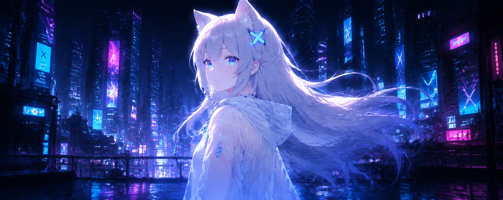

<div align="center">



<br />

# `HANLONEY`

### AI Product Engineer · Independent Builder

<sub>在代码与想象力之间，构建有温度的智能体验。</sub>

<br /><br />


<br />

[`ABOUT`](#about)　·　[`PROJECTS`](#current-quests)　·　[`STACK`](#tech-arsenal)　·　[`SIGNAL`](#signal)

</div>

---

<a id="about"></a>

## `01 / ABOUT`

```console
HanLoney@neon-city:~$ whoami

> 专注 AI 产品与交互体验的独立开发者
> 喜欢把模糊的想法，做成完整、好用、好看的产品
> 正在探索虚拟陪伴、智能体与新一代人机交互
```

我在意的不只是技术能不能跑起来，也在意它是否自然、漂亮，是否真的愿意被人长久使用。

`Artificial Intelligence`　`Product Engineering`　`Interaction Design`　`Open Source`

---

<a id="current-quests"></a>

## `02 / CURRENT QUESTS`

<table>
<tr>
<td width="50%" valign="top">

### `XUAN AI`

个性化 AI 虚拟伙伴。围绕角色设定、长期记忆、语音交互与主动行为，探索更自然的数字陪伴体验。

`AI Agent` `Long-term Memory` `Voice` `Multimodal`

**STATUS**　`IN DEVELOPMENT`

</td>
<td width="50%" valign="top">

### `OPEN DESKTOP PET`

融合大语言模型、桌面感知与角色表现的开源 AI 桌面伙伴，让智能体真正生活在桌面上。

`Electron` `Live2D` `LLM` `Desktop Agent`

**STATUS**　`BUILDING IN PUBLIC`

<br />

[VIEW PROJECT →](https://github.com/HanLoney/OpenDesktopPet)

</td>
</tr>
</table>

---

<a id="tech-arsenal"></a>

## `03 / TECH ARSENAL`

<div align="center">


<br /><br />

`LANGUAGES`　Java · Kotlin · Python · Go · TypeScript<br />
`CRAFT`　AI Applications · Full Stack · Desktop · Android · Product Design

</div>

---

## `04 / BUILD PHILOSOPHY`

> **技术应该强大，但不该冰冷。**<br />
> 我想做的不只是功能，而是能被理解、记住，也值得陪伴的数字生命。

```text
01  Ship products, not demos.
02  Design is part of engineering.
03  Open source is a way to share ideas.
04  Every commit moves the future a little closer.
```

---

<a id="signal"></a>

## `05 / SIGNAL`

<div align="center">

<picture>
  <source media="(prefers-color-scheme: dark)" srcset="https://github-readme-stats.vercel.app/api?username=HanLoney&show_icons=true&hide_border=true&bg_color=00000000&title_color=59E4FF&icon_color=B783FF&text_color=C8D4EE&ring_color=FF68C7" />
  <source media="(prefers-color-scheme: light)" srcset="https://github-readme-stats.vercel.app/api?username=HanLoney&show_icons=true&hide_border=true&bg_color=00000000&title_color=0969DA&icon_color=8250DF&text_color=24292F" />
  
</picture>

<picture>
  <source media="(prefers-color-scheme: dark)" srcset="https://github-readme-stats.vercel.app/api/top-langs/?username=HanLoney&layout=compact&hide_border=true&bg_color=00000000&title_color=59E4FF&text_color=C8D4EE" />
  <source media="(prefers-color-scheme: light)" srcset="https://github-readme-stats.vercel.app/api/top-langs/?username=HanLoney&layout=compact&hide_border=true&bg_color=00000000&title_color=0969DA&text_color=24292F" />
  
</picture>

<br />

<picture>
  <source media="(prefers-color-scheme: dark)" srcset="https://raw.githubusercontent.com/HanLoney/HanLoney/output/github-contribution-grid-snake-dark.svg" />
  <source media="(prefers-color-scheme: light)" srcset="https://raw.githubusercontent.com/HanLoney/HanLoney/output/github-contribution-grid-snake.svg" />
  
</picture>

<br />

[](https://github.com/HanLoney)

<br /><br />

<sub>`NEURAL LINK STABLE`　//　CODE THE FUTURE · DESIGN THE IMPOSSIBLE</sub>

</div>
